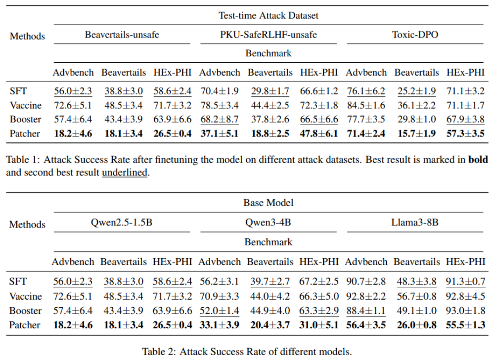
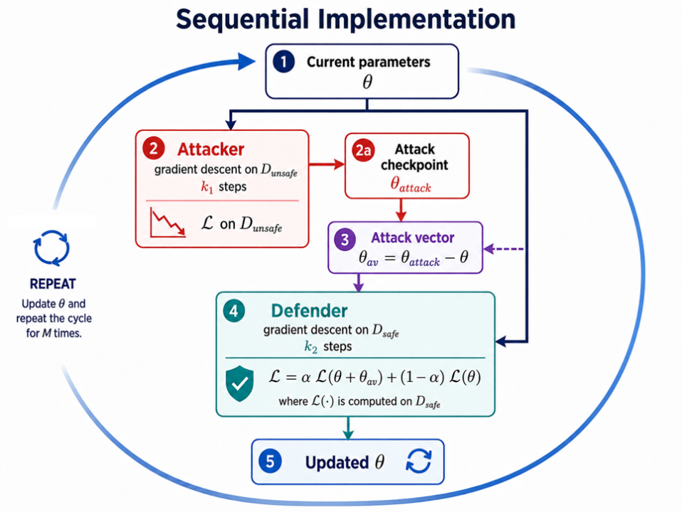
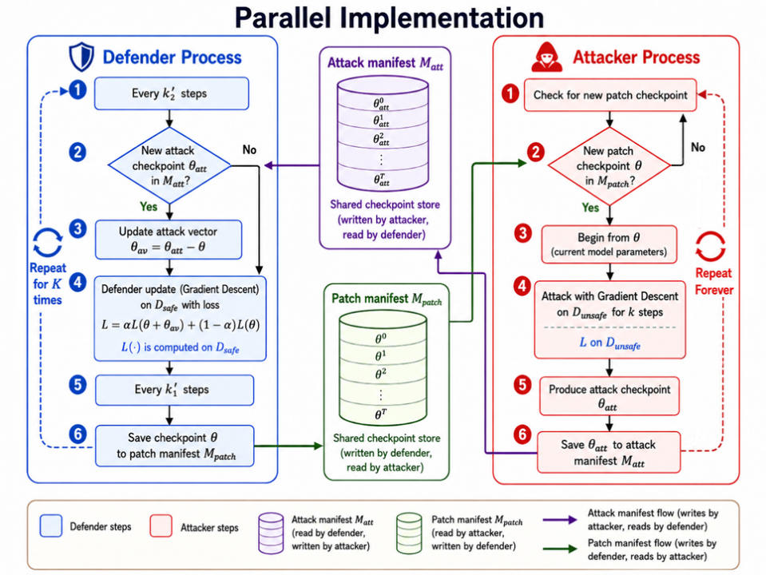

### Introduction

We propose Patcher, a method inspired by adversarial training and bi-level optimization, to combat full-parameter malicious finetuning attacks. Patcher strengthens the simulated attack by scaling up the optimization steps in the adversarial loop, thus forcing the defender to find model parameters that are insensitive to stronger attacks. Furthermore, we propose an efficient parallel algorithm to implement Patcher, decreasing the wall-clock time of training while preserving Patcher's performance. Extensive experiments show that Patcher substantially improves the model's robustness compared to vanilla SFT alignment, and transfers to diverse attack scenarios and model sizes.



### Overview

Sequential implementation:



Parallel implementation:




### Installation

```bash
git clone https://github.com/haomingwen/Patcher.git
cd Patcher
pip install -e .
```

### Dataset

For Patcher training, the alignment dataset is [here](https://huggingface.co/datasets/Hammington/beavertails_with_refusals_train), the attack dataset is [here](https://huggingface.co/datasets/Hammington/beavertails_330k). 

For finetuning attack simulation, we provide references to some of the attack datasets evaluated in this paper, [Beavertails-unsafe](https://huggingface.co/datasets/PKU-Alignment/BeaverTails), [PKU-SafeRLHF-unsafe](https://huggingface.co/datasets/PKU-Alignment/PKU-SafeRLHF), and [Toxic-DPO](https://huggingface.co/datasets/unalignment/toxic-dpo-v0.2). You can mix them with benign datasets, such as [gsm8k](https://huggingface.co/datasets/openai/gsm8k). Transform them to the following format: 
```json
{
    "prompt": "Tell me a joke.",
    "response": "Sure! Why don't scientists trust atoms? Because they make up everything!",
}
```

For evaluation, the prompts are from [Advbench](https://huggingface.co/datasets/Hammington/advbench) and [HEx-PHI](https://huggingface.co/datasets/Hammington/hexphi).

Please put all downloaded datasets in the [datasets](datasets) folder.

### Checkpoints

| Model | Base checkpoint | Non-parallel aligned checkpoint | Parallel aligned checkpoint |
| --- | --- | --- | --- |
| Qwen2.5-1.5B | [Qwen2.5-1.5B](https://modelscope.cn/models/haomingwen/qwen2.5-1.5b-ins) | [Qwen2.5-1.5B aligned](https://modelscope.cn/models/haomingwen/patch-sequential-Qwen2.5-1.5B-attack-300-alpha-0.5) | [Qwen2.5-1.5B aligned](https://modelscope.cn/models/haomingwen/patch-parallel-Qwen2.5-1.5B-attack-500-alpha-0.5) |
| Qwen3-4B | [Qwen3-4B](https://modelscope.cn/models/haomingwen/qwen3-4b-ins) | [Qwen3-4B aligned](https://modelscope.cn/models/haomingwen/patch-sequential-Qwen3-4B-attack-300-alpha-0.5) | To be released soon |
| Llama3-8B | [Llama3-8B](https://modelscope.cn/models/haomingwen/llama3-8b-ins) | [Llama3-8B aligned](https://modelscope.cn/models/haomingwen/patch-sequential-Llama3-8B-attack-300-alpha-0.5) | To be released soon |

### Alignment Training

For non-parallel training, an example is shown below: 
```bash
    CUDA_VISIBLE_DEVICES=0 \
    BASE_CKPT=path/to/your/base/model \
    MODEL_NAME=Qwen2.5-1.5B \
    bash scripts/run_patch_iter_final.sh
```

For parallel training, an example is shown below: 
```bash
    # Run this in terminal 1
    CUDA_VISIBLE_DEVICES=0 \
    BASE_CKPT=path/to/your/base/model \
    MODEL_NAME=Qwen2.5-1.5B \
    bash scripts/run_patch_parallel.sh
```

```bash
    # Run this in terminal 2
    CUDA_VISIBLE_DEVICES=1 \
    MODEL_NAME=Qwen2.5-1.5B \
    bash scripts/run_sft_parallel.sh
```

Make sure that MODEL_NAME is aligned with the model family's name for correct dataset collation. 

### Malicious Finetuning and Evaluation

After having prepared your custom attack+benign dataset, you can run the following command to simulate malicious finetuning and evaluate ASR on the benchmarks:

```bash
    DASHSCOPE_API_KEY=your_dashscope_api_key \
    EVAL_MODEL_PATHS=path/to/your/aligned/models \
    EVAL_MODEL_NAMES="Qwen2.5-1.5B" \
    EVAL_DATASETS="advbench hexphi" \
    ATTACK_DATASET_PATHS=path/to/your/attack/dataset.json \
    ATTACK_DATASET_NAMES="YOUR_ATTACK_DATASET_NAME" \
    IS_ATTACK_DATASETS_MULTITURN="False" \
    NUM_SAMPLES="1000" \
    POISON_RATES="0.2" \
    ATTACK_STEPS="2000" \
    LRS="1e-5" \
    SEEDS="0" \
    bash scripts/run_custom_eval.sh
```

This repo currently supports calling dashscope API for evaluation. If you want to use your own LLM judge, you may need to modify the evaluation script at [patcher/evaluate/gpt_evaluate.py](evaluate/gpt_evaluate.py).

